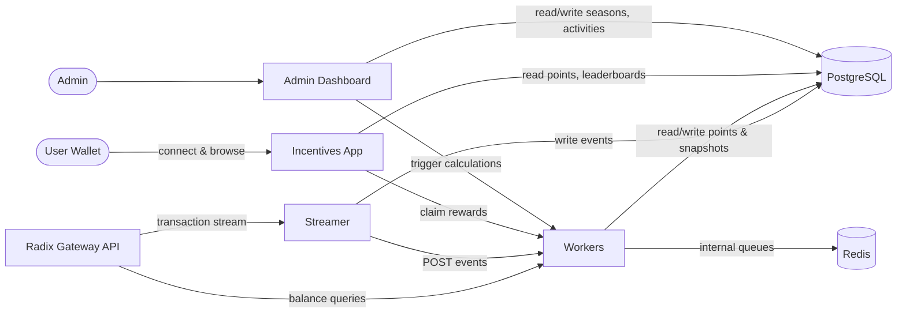

# Architecture

## Service Diagram

## Services

**Streamer** — Connects to the Radix Gateway API and tails the transaction stream. Matches on-chain events (swaps, deposits, stakes) to known DeFi protocol addresses and writes them to PostgreSQL. Sends matched events to Workers via HTTP POST.

**Workers** — Exposes HTTP endpoints that accept jobs from Streamer, Incentives App, and Admin Dashboard. Internally uses BullMQ on Redis to queue and process work: balance snapshots via the Gateway API, time-weighted activity point calculations, season point aggregation with XRD/LSU holding multipliers, and reward claim processing. All results are persisted to PostgreSQL.

**Incentives App** — A Next.js frontend where users connect their Radix wallet, view earned points, check the leaderboard, and claim season rewards. Reads from PostgreSQL via tRPC; triggers reward claims via Workers HTTP endpoints.

**Admin Dashboard** — A Next.js frontend for managing seasons, weeks, and activity configurations. Reads from and writes to PostgreSQL via tRPC; triggers point calculations and other jobs via Workers HTTP endpoints.

## External Dependencies

**Postgres** — Primary datastore for events, snapshots, points, seasons, and user accounts.

**Redis** — Internal job queue backend (BullMQ) used exclusively by Workers.

**Radix Gateway API** — Blockchain data source for the transaction stream and account balance queries.
