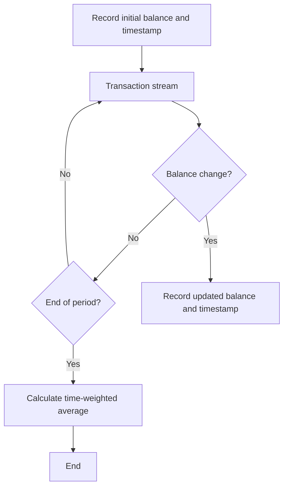

# Multiplier TWA calculation

The multiplier component uses a Time-Weighted Average (TWA) calculation to determine user holding levels for XRD, LSUs, and other whitelisted derivatives. This ensures fair multiplier allocation based on actual holding duration.

## Time-Weighted Average (TWA) Calculation

```
TWA = (∑(balance_i × time_interval_i)) ÷ total_time
```

Where:

- `balance_i` is the account balance during interval i
- `time_interval_i` is the duration of interval i
- `total_time` is the sum of all time intervals

## Flow Diagram



## Examples

### Example 1: Consistent Balance

If an account maintains 10,000 XRD for the entire 7-day period:

- Balance: 10,000 XRD
- Duration: 7 days
- TWA = (10,000 × 7) ÷ 7 = 10,000 XRD

### Example 2: Balance Increase

If an account starts with 5,000 XRD for 1 day, then increases to 10,000 XRD for the remaining 6 days:

- 5,000 XRD for 1 day = 5,000 × 1 = 5,000 XRD-days
- 10,000 XRD for 6 days = 10,000 × 6 = 60,000 XRD-days
- Total: 65,000 XRD-days over 7 days
- TWA = 65,000 ÷ 7 = 9,285.71 XRD

### Example 3: Temporary Zero Balance

If an account holds 10,000 XRD for 3 days, then 0 XRD for 3 days, then 10,000 XRD for 1 day:

- 10,000 XRD for 3 days = 10,000 × 3 = 30,000 XRD-days
- 0 XRD for 3 days = 0 × 3 = 0 XRD-days
- 10,000 XRD for 1 day = 10,000 × 1 = 10,000 XRD-days
- Total: 40,000 XRD-days over 7 days
- TWA = 40,000 ÷ 7 = 5,714.29 XRD

### Example 4: Last-Minute Balance

If an account holds 0 XRD for 6 days and only adds 10,000 XRD on the last day:

- 0 XRD for 6 days = 0 × 6 = 0 XRD-days
- 10,000 XRD for 1 day = 10,000 × 1 = 10,000 XRD-days
- Total: 10,000 XRD-days over 7 days
- TWA = 10,000 ÷ 7 = 1,428.57 XRD

## Implementation

The TWA calculation ensures that:

- Users are rewarded for consistent, long-term holding
- Brief spikes or last-minute deposits have minimal impact
- The multiplier accurately reflects actual asset holding behavior
- Anti-farming controls are enforced through time weighting
