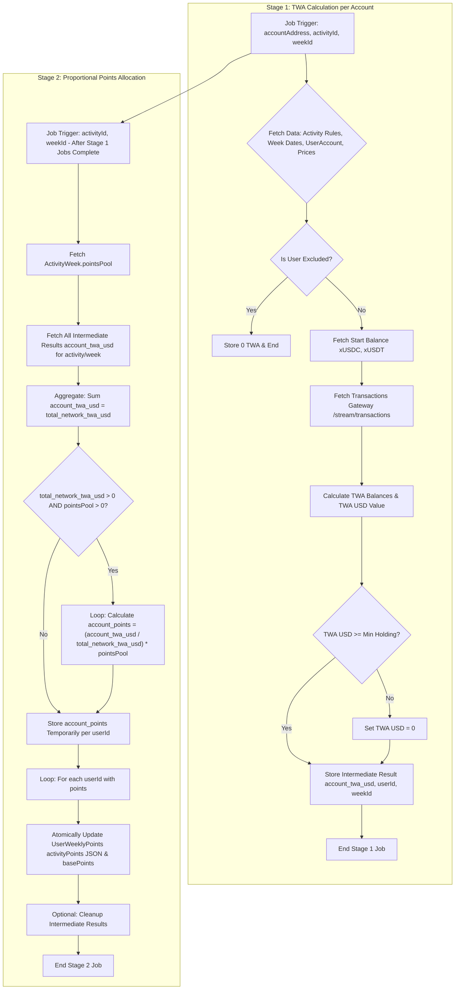

# ✅ 1.2 Bridging/holding stable assets (xUSDC, xUSDT)

- **Type**: Passive
- **Reward Type**: Points
- **Priority**: High
- **Assets:** xUSDC, xUSDT
- **Rules**:
  - Award points based on time-weighted average (TWA) USD value held.
  - Distribute weekly points pool proportionally.
  - Config: Weekly points pool size.
  - Set minimum average holding (e.g., $100 USD).
  - Config: Minimum holding value.
  - Requires balance tracking.

## Implementation

### Granularity Discussion

Similar to Activity 1.1 (Holding XRD/LSU), calculating the Time-Weighted Average (TWA) USD value directly from Gateway transaction streams is the most accurate approach but computationally intensive. We need to choose the right job granularity:

- **a) `accountAddress & activityId`**: Isolates the complex TWA calculation per account. Requires a subsequent aggregation step for proportional point allocation.
- **b) `activityId`**: Calculates TWA for all accounts in one batch. Complex error handling, less scalable for many accounts.
- **c) `userId & activityId`**: Calculates TWA for all linked accounts of a user for this activity. Complex job logic and error handling.
- **d) `userId`**: Calculates TWA for all activities for all linked accounts of a user. Extremely complex jobs.

**Decision:** Adopt **granularity by `accountAddress & activityId` (Option a)**. This isolates the complex TWA calculation from Gateway data to a single account per job. A separate Stage 2 process will handle the aggregation and proportional point allocation from the weekly pool.

### Stage 1: Processing Flow (BullMQ Job - TWA Calculation per Account)

1.  **Initialization & Data Fetching:**

    - Receive job: `{ accountAddress, activityId, weekId }`.
    - Fetch `Activity` rules using `activityId` (stablecoin addresses: xUSDC, xUSDT; minimum holding value).
    - Fetch `Week` details using `weekId` (`startDate`, `endDate`). Map dates to Ledger State Versions if needed for Gateway queries.
    - Fetch `UserAccount` record for `accountAddress` to get `userId` and check `is_excluded`. If excluded, store 0 value (Step 7) and terminate successfully.
    - Fetch end-of-week USD prices for xUSDC, xUSDT (e.g., via Price Oracle API, utilize caching. Assume 1:1 USD pegging as a fallback if oracle fails, but log this).

2.  **Fetch Starting Balance:**

    - Fetch the balances of xUSDC & xUSDT for `accountAddress` at the state version _just before_ the week `startDate` (using `at_ledger_state` parameter on state endpoint). Handle accounts not existing or having 0 balance.

3.  **Fetch Balance-Changing Transactions:**

    - Use `/stream/transactions` endpoint.
    - **Filters:**
      - `kind_filter`: "User"
      - Specify ledger state range for the week.
      - Combine filters: `affected_global_entities_filter`: [`accountAddress`] and `manifest_resources_filter`: [xUSDC_address, xUSDT_address].
      - _(Refer to GW expert comment in 1.1 - client-side validation of movements might still be needed)._
    - **Opt-ins:** Request `receipt_resource_movements`.
    - Fetch all transactions within the range (handle pagination).

4.  **Calculate TWA USD Value for this Account:**

    - Initialize balance timeline with the starting balance (Step 2).
    - Process fetched transactions chronologically:
      - Validate resource movements confirm deposit/withdrawal of xUSDC/xUSDT involving `accountAddress`.
      - Update the balance timeline.
    - Calculate TWA balance for xUSDC and xUSDT.
    - Calculate `account_twa_usd = (TWA_xUSDC * price_xUSDC) + (TWA_xUSDT * price_xUSDT)`. Use fetched prices, fallback to 1.0 if needed.

5.  **Eligibility Check (Minimum Average Holding):**

    - Retrieve `min_holding_value` from `Activity.rules`.
    - If `account_twa_usd < min_holding_value`, set `account_twa_usd = 0`.

6.  **Store Intermediate Result:**

    - Store the calculated `account_twa_usd` value (which could be 0 if ineligible) temporarily, associated with `userId`, `accountAddress`, `activityId`, and `weekId`. Use a system like Redis cache with TTL or a dedicated table (e.g., `UserAccountWeeklyActivityValue`). This represents the account's weighted contribution.

7.  **Job Finalization:**
    - Log success/result (including the TWA value).
    - Acknowledge job completion. This job **does not** allocate points.

### Stage 2: Processing Flow (Separate Job/Trigger - Proportional Points Allocation)

1.  **Trigger:** Run this job after all Stage 1 jobs for a specific `activityId` and `weekId` are expected to be complete (e.g., using BullMQ flows, time delay, or count completion).
2.  **Input:** `{ activityId, weekId }`.
3.  **Fetch Data & Aggregate:**

    - Fetch `ActivityWeek` record using `activityId` and `weekId` to get the `pointsPool`.
    - Retrieve all stored intermediate `account_twa_usd` values for this activity/week from the intermediate storage (Redis/DB table).
    - Sum all positive `account_twa_usd` values across all accounts: `total_network_twa_usd = sum(account_twa_usd where account_twa_usd > 0)`.

4.  **Calculate & Allocate Points:**

    - If `total_network_twa_usd > 0` and `pointsPool > 0`:
      - Iterate through each intermediate result `{ userId, account_twa_usd }` where `account_twa_usd > 0`:
        - Calculate `account_points = (account_twa_usd / total_network_twa_usd) * pointsPool`.
        - Store this `account_points` value temporarily associated with the `userId` for this activity/week.
    - Else (total TWA is 0 or pool is 0), no points are allocated for this activity this week.

5.  **Store Final Points in UserWeeklyPoints:**

    - Iterate through the calculated `account_points` for each `userId`.
    - For each `userId` with `account_points > 0`:
      - Find or create the `UserWeeklyPoints` record for (`userId`, `weekId`).
      - **Atomically** update the `activityPoints` JSON field: `{ ..., [activityId]: account_points, ... }`.
      - **Atomically** increment the `basePoints` field by `account_points`. (Ensure atomicity to prevent race conditions if other activities update the same record).

6.  **Job Finalization & Cleanup:**
    - Log success, number of users allocated points, and total points allocated.
    - Optionally clear the intermediate `account_twa_usd` results for this activity/week from Redis/DB.
    - Acknowledge job completion.

### Dependencies (Stage 1 & 2 Jobs)

- BullMQ Client/Worker
- Radix Gateway SDK Client
- Price Oracle Client
- Caching Service Client (e.g., Redis) or DB Client for intermediate results
- Database Client (PostgreSQL via Drizzle ORM)

### Database Interactions (Stage 1 Job)

- **Read:** `Activity`, `Week`, `UserAccount`
- **Write/Update:** Intermediate storage (Redis cache or `UserAccountWeeklyActivityValue` table)

### Database Interactions (Stage 2 Job)

- **Read:** `ActivityWeek`, Intermediate storage (Redis cache or `UserAccountWeeklyActivityValue` table)
- **Read/Write/Update:** `UserWeeklyPoints` (Atomic updates crucial)
- **Delete:** Intermediate storage (Optional cleanup)

### Error Handling (Stage 1 Job)

- Define retry strategy for failed Gateway calls.
- Handle errors during TWA calculation (log, store error state or 0 in intermediate result).
- Handle missing/failed price data (log, potentially fallback to 1.0 USD for stables, or fail the TWA calculation).
- Gracefully handle accounts below the minimum average holding threshold (result is 0 TWA).

### Error Handling (Stage 2 Job)

- Handle failure in fetching intermediate results (retry job).
- Handle `total_network_twa_usd` being zero (log, complete successfully with 0 points allocated).
- Handle potential errors during atomic updates to `UserWeeklyPoints` (retry mechanism, ensure idempotency if possible).

### Considerations

- **Stablecoin Peg:** While xUSDC/xUSDT aim for a 1:1 peg, fetching actual market prices is more robust if available. Fallback to 1.0 if oracles fail.
- **Efficiency:** Fetching transactions for potentially millions of accounts can be intensive. Optimize Gateway queries and batching where possible. Consider caching heavily.
- **Atomicity:** The update to `UserWeeklyPoints` in Stage 2 must be atomic, especially the increment of `basePoints`, as multiple activities might update the same record concurrently. Use database transaction mechanisms.

