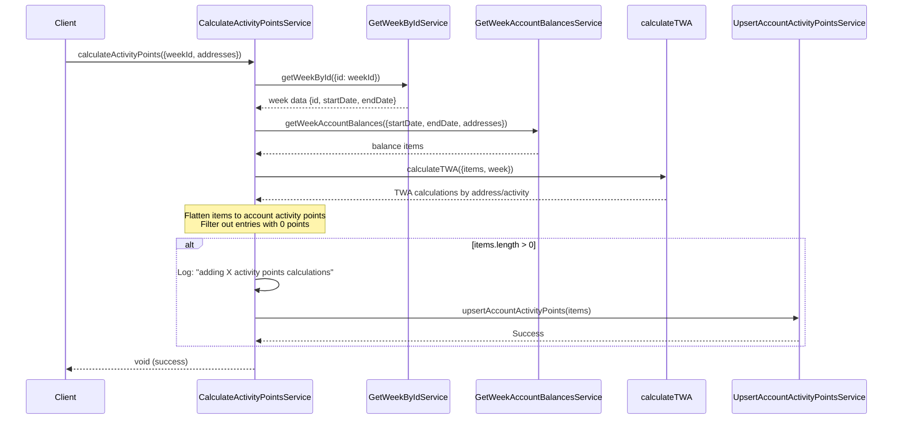

# Calculate Activity Points Implementation

## Overview

The `calculateActivityPoints` function is a core component of the Radix Incentives Campaign Platform that processes weekly activity points for user accounts. It calculates Time Weighted Average (TWA) points based on account balances and activities within a specific week period.

## Function Signature

```typescript
calculateActivityPoints(input: CalculateActivityPointsInput): Effect<void, CalculateActivityPointsError, CalculateActivityPointsDependency>
```

### Input Schema

```typescript
{
  weekId: string,     // Unique identifier for the week
  addresses: string[] // Array of Radix account addresses to process
}
```

### Dependencies

- `DbClientService` - Database client for data operations
- `UpsertAccountActivityPointsService` - Service to save/update activity points
- `GetWeekByIdService` - Service to retrieve week details
- `GetWeekAccountBalancesService` - Service to fetch account balances for the week

### Error Types

- `DbError` - Database operation errors
- `WeekNotFoundError` - When specified week doesn't exist
- `GetWeekByIdError` - Errors retrieving week data

## Sequence Diagram



## Implementation Flow

1. **Week Validation**: Retrieves week details using `weekId` to ensure the week exists and get start/end dates
2. **Balance Collection**: Fetches account balances for all specified addresses within the week timeframe
3. **TWA Calculation**: Processes balance data through Time Weighted Average calculation
4. **Data Transformation**: 
   - Flattens the nested structure from `{address -> {activityId -> points}}` to array format
   - Maps to `{accountAddress, activityId, activityPoints, weekId}` objects
5. **Filtering**: Removes entries where `activityPoints` equals 0 to avoid storing empty records
6. **Persistence**: If any valid points exist, logs the count and saves via `UpsertAccountActivityPointsService`

## Data Transformation

### Input Structure (from calculateTWA)
```typescript
{
  [address: string]: {
    [activityId: string]: Decimal
  }
}
```

### Output Structure (to UpsertAccountActivityPointsService)
```typescript
Array<{
  accountAddress: string,
  activityId: string,
  activityPoints: number,
  weekId: string
}>
```

## Performance Considerations

- Processes multiple accounts in batch for efficiency
- Filters out zero-point entries to reduce database writes
- Uses Effect library for functional composition and error handling
- Logs processing counts for monitoring and debugging

## Error Handling

The function uses Effect library's error handling capabilities:
- Database connection failures are propagated as `DbError`
- Invalid week IDs result in `WeekNotFoundError`
- All errors are typed and handled functionally through the Effect chain

## Usage Context

This function is typically called:
- During weekly point calculation jobs
- When processing retroactive point adjustments
- For specific account recalculations
- As part of the week completion workflow in the admin dashboard
