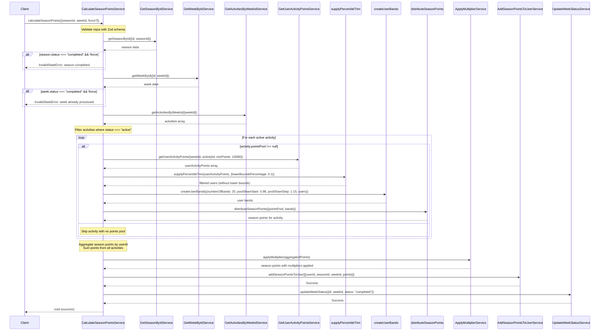

# Calculate Season Points Implementation

## Overview

The `calculateSeasonPoints` function is a critical component of the Radix Incentives Campaign Platform that converts weekly activity points into season points using a sophisticated percentile-based distribution system. It processes all active activities for a given week, applies user banding, distributes points from activity pools, and applies multipliers to generate final season points.

## Function Signature

```typescript
calculateSeasonPoints(input: CalculateSeasonPointsInput): Effect<void, CalculateSeasonPointsError, CalculateSeasonPointsDependency>
```

### Input Schema

```typescript
{
  seasonId: string,        // Unique identifier for the season
  weekId: string,          // Unique identifier for the week to process
  force?: boolean          // Optional flag to bypass completed status checks
}
```

### Dependencies

- `DbClientService` - Database client for data operations
- `GetSeasonByIdService` - Service to retrieve season details
- `GetWeekByIdService` - Service to retrieve week details
- `GetActivitiesByWeekIdService` - Service to fetch activities for the week
- `GetUserActivityPointsService` - Service to get user activity points
- `ApplyMultiplierService` - Service to apply user-specific multipliers
- `AddSeasonPointsToUserService` - Service to save season points to users
- `UpdateWeekStatusService` - Service to update week completion status

### Error Types

- `DbError` - Database operation errors
- `InputValidationError` - Zod schema validation failures
- `InvalidStateError` - When season/week is already completed (unless force flag is used)
- `GetSeasonByIdError` - Errors retrieving season data
- `GetWeekByIdError` - Errors retrieving week data
- `GetActivitiesByWeekIdError` - Errors fetching activities
- `GetUserActivityPointsError` - Errors getting user points

## Sequence Diagram



## Implementation Flow

1. **Input Validation**: Validates input using Zod schema for type safety
2. **State Validation**: 
   - Checks if season is completed (fails unless `force` flag is true)
   - Checks if week is already processed (fails unless `force` flag is true)
3. **Activity Collection**: Retrieves all activities for the specified week
4. **Active Activity Processing**: For each activity with `status === "active"`:
   - **Points Retrieval**: Gets user activity points with minimum threshold (10,080 points)
   - **Percentile Trimming**: Removes bottom 10% of performers using `supplyPercentileTrim`
   - **User Banding**: Creates 20 performance tiers using exponential distribution
   - **Point Distribution**: Distributes activity's points pool across bands
5. **Point Aggregation**: Combines season points from all activities by user ID
6. **Multiplier Application**: Applies user-specific multipliers (based on XRD/LSU holdings)
7. **Persistence**: Saves final season points to database
8. **Week Completion**: Marks week as "completed" to prevent reprocessing

## Key Configuration Parameters

### Hardcoded Values (TODO: Move to database)
- **Minimum Points Threshold**: 10,080 points (users below this are excluded)
- **Lower Bounds Percentage**: 10% (bottom performers excluded)
- **Number of Bands**: 20 tiers for point distribution
- **Pool Share Start**: 98% (starting distribution percentage)
- **Pool Share Step**: 1.15 (exponential growth factor between bands)

### Banding System

The function uses a sophisticated 20-tier banding system:
- Users are ranked by their activity points
- Bottom 10% are excluded via percentile trimming
- Remaining users are divided into 20 performance bands
- Points are distributed exponentially, with higher bands receiving disproportionately more points
- This creates a competitive environment that rewards top performers

## Data Flow

### Activity Processing Pipeline
```
User Activity Points → Percentile Trimming → User Banding → Point Distribution → Activity Season Points
```

### Final Aggregation Pipeline
```
Activity Season Points → User Aggregation → Multiplier Application → Database Persistence
```

## Performance Considerations

- Processes multiple activities in parallel using `Effect.forEach`
- Uses BigNumber for precise decimal calculations
- Filters out activities without points pools to avoid unnecessary processing
- Efficient aggregation using reduce operations
- Comprehensive logging for monitoring and debugging

## Error Handling

The function implements robust error handling:
- **Input Validation**: Zod schema validation with detailed error messages
- **State Validation**: Prevents double-processing with clear error messages
- **Force Override**: Allows administrators to bypass safety checks when needed
- **Effect Chain**: All errors are typed and propagated through the Effect chain

## Business Logic

### Percentile-Based Distribution
- Ensures fair competition by removing bottom performers
- Creates scarcity that encourages higher engagement
- Prevents dilution of rewards across inactive users

### Exponential Band Distribution
- Rewards top performers significantly more than average performers
- Creates strong incentives for users to maximize their activity
- Maintains competitive dynamics throughout the season

### Multiplier Integration
- XRD/LSU holding multipliers are applied after base season points calculation
- Encourages long-term holding behavior alongside active participation
- Provides additional reward layer for committed ecosystem participants

## Usage Context

This function is typically called:
- At the end of each week during the week completion process
- By administrators through the admin dashboard
- During retroactive recalculations (using `force` flag)
- As part of automated weekly processing jobs
- When testing new distribution parameters

## Security Considerations

- **Force Flag**: Restricted to admin users only
- **State Validation**: Prevents accidental double-processing
- **Input Validation**: Ensures data integrity through Zod schemas
- **Audit Trail**: Comprehensive logging for all operations
