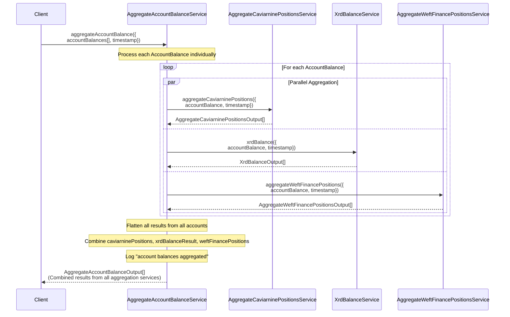

# AggregateAccountBalanceService

## Overview

The `AggregateAccountBalanceService` is a critical component in the Radix Incentives Campaign Platform that processes raw account balance data and converts it into structured, USD-valued position data. This service takes comprehensive account balances from various DeFi protocols and aggregates them into standardized formats suitable for points calculation, multiplier determination, and activity tracking.

## Sequence Diagram



## Process Flow

### 1. Input Processing
- Receives an array of `AccountBalance` objects containing raw balance data
- Each `AccountBalance` includes positions across multiple DeFi protocols
- Takes a timestamp for USD value calculations and activity identification

### 2. Parallel Aggregation Processing
For each account balance, the service simultaneously processes positions through three specialized aggregation services:

**Caviar Nine Positions Aggregation**:
- Processes DEX liquidity positions
- Handles XRD/xUSDC Shape liquidity assets
- Converts liquidity positions to USD values
- Identifies activity IDs for points calculation

**XRD Balance Aggregation**:
- Processes native XRD holdings
- Handles staked XRD positions (LSUs) with XRD equivalent conversion
- Processes unstaking claims and withdrawal eligibility
- Handles LSULP (Liquid Staking Unit LP) positions
- Converts all XRD-related positions to USD values

**Weft Finance Positions Aggregation**:
- Processes lending protocol positions
- Handles supplied assets (lending positions)
- Processes borrowed assets (debt positions)
- Converts all positions to USD values for points calculation

### 3. Result Processing and Combination
- Flattens results from all individual account processing
- Combines outputs from all three aggregation services
- Creates a unified array of `AggregateAccountBalanceOutput` objects
- Logs completion of the aggregation process

## Data Types

### Input Structure
```typescript
type AggregateAccountBalanceInput = {
  accountBalances: AccountBalance[];  // Raw balance data from blockchain
  timestamp: Date;                    // For USD conversion and activity tracking
};
```

### Output Structure
```typescript
type AggregateAccountBalanceOutput =
  | AggregateCaviarninePositionsOutput  // Caviar Nine DEX/LP positions
  | XrdBalanceOutput                    // XRD/LSU/LSULP positions
  | AggregateWeftFinancePositionsOutput; // Weft Finance lending positions
```

### Key Dependencies
```typescript
type AggregateAccountBalanceServiceDependency =
  | AggregateCaviarninePositionsService   // Caviar Nine position processing
  | XrdBalanceService                     // XRD balance processing
  | GetUsdValueService                    // USD conversion service
  | AggregateWeftFinancePositionsService; // Weft Finance processing
```

## Aggregation Services

### AggregateCaviarninePositionsService
**Purpose**: Processes Caviar Nine protocol positions
- **Liquidity Positions**: XRD/xUSDC Shape pools
- **LP Token Values**: Current USD values of liquidity positions
- **Activity Identification**: Maps positions to specific activity IDs
- **Price Calculations**: Uses current exchange rates for accurate valuations

### XrdBalanceService
**Purpose**: Processes all XRD-related holdings and positions
- **Native XRD**: Direct XRD token holdings
- **Staked XRD (LSUs)**: Liquid staking units with XRD equivalent conversion
- **Unstaking Claims**: Pending unstaking positions
- **LSULP Positions**: Liquid Staking Unit LP tokens
- **Multiplier Calculation**: Provides data for S-curve multiplier determination

### AggregateWeftFinancePositionsService
**Purpose**: Processes Weft Finance lending protocol positions
- **Lending Positions**: Assets supplied to the protocol
- **Borrowing Positions**: Debt obligations and collateral
- **Interest Calculations**: Accrued interest and yields
- **USD Valuations**: Current market values of all positions

## Performance Characteristics

### Parallel Processing
- Uses `Effect.forEach` with parallel execution for each account
- Each account's positions are processed through all three services simultaneously
- Maximizes throughput when processing large numbers of accounts

### Memory Efficiency
- Processes accounts individually to avoid large memory allocations
- Flattens results efficiently using `Effect.map((items) => items.flat())`
- Maintains memory efficiency even with complex position structures

### Error Handling
The service handles specific error types:
- **InvalidResourceAddressError**: Invalid token addresses during processing
- **PriceServiceApiError**: USD price lookup failures
- Errors are properly typed and propagated for appropriate upstream handling

## Usage in Incentives Campaign

This service is fundamental to the incentives campaign for several key functions:

### Points Calculation Foundation
- Converts raw balance data into structured position data
- Provides USD values needed for proportional point allocation
- Maps positions to specific activity IDs for point distribution

### Multiplier Determination
- XRD balance aggregation provides data for S-curve multiplier calculations
- Includes staked XRD (LSUs) and LSULP positions
- Ensures accurate multiplier application based on total XRD exposure

### Activity Tracking
- Identifies which protocols and positions users are engaged with
- Provides baseline data for detecting new activities
- Tracks position changes over time for activity recognition

### USD Valuation Accuracy
- Uses real-time price data for accurate USD conversions
- Ensures fair point allocation based on actual position values
- Supports historical analysis and trend identification

### Protocol Coverage
- Comprehensive coverage of major Radix DeFi protocols
- Extensible architecture for adding new protocol aggregators
- Unified output format simplifies downstream processing

## Integration with Snapshot Process

This service is a critical component in the larger snapshot workflow:

1. **Raw Data Input**: Receives `AccountBalance` objects from `GetAccountBalancesAtStateVersionService`
2. **Value Conversion**: Converts all positions to USD values for fair comparison
3. **Activity Mapping**: Maps positions to specific activity types for points calculation
4. **Data Output**: Provides structured data for storage in `UpsertAccountBalancesService`

The aggregation process ensures that all user positions across the Radix ecosystem are properly valued, categorized, and prepared for the incentives campaign's points calculation and multiplier application mechanisms.

## Future Extensibility

The service architecture supports easy extension for new DeFi protocols:
- New aggregation services can be added to the parallel processing pattern
- Output types can be extended with union types
- The unified processing approach ensures consistent handling across all protocols

This design ensures the incentives platform can grow with the Radix DeFi ecosystem while maintaining performance and accuracy.
