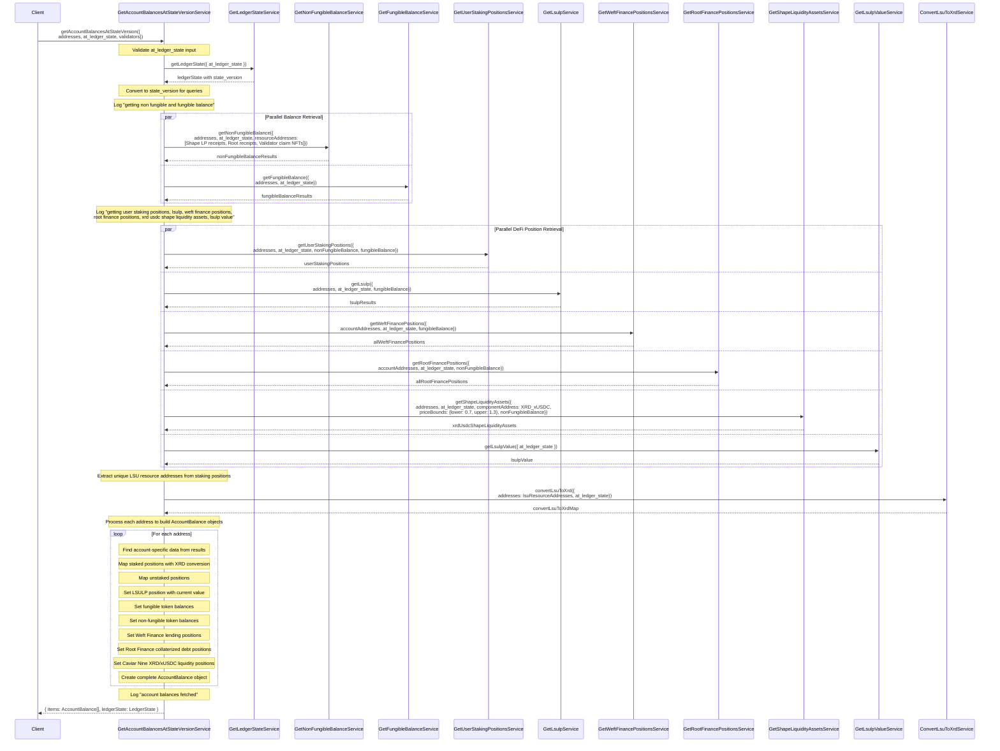

# GetAccountBalancesAtStateVersionService

## Overview

The `GetAccountBalancesAtStateVersionService` is a core component of the Radix Incentives Campaign Platform that retrieves comprehensive account balance data at a specific blockchain state version. This service aggregates data from multiple sources including native staking, DeFi protocols, and token balances to provide a complete picture of user positions across the Radix ecosystem.

## Sequence Diagram



## Process Flow

### 1. Input Validation and State Resolution
- Validates the `at_ledger_state` input parameter
- Converts timestamp to specific blockchain state version
- Ensures all subsequent queries use the same state version for consistency

### 2. Parallel Token Balance Retrieval
Simultaneously fetches two types of token balances:

**Non-Fungible Tokens (NFTs)**:
- Shape liquidity pool receipts (XRD/xUSDC)
- Root Finance receipt tokens
- Validator claim NFTs for staking positions

**Fungible Tokens**:
- All fungible token balances for the specified addresses
- Includes XRD, stablecoins, LSUs, and other tokens

### 3. Parallel DeFi Position Retrieval
Concurrently fetches position data from multiple DeFi protocols:

**Native Staking Positions**:
- Staked XRD positions across validators (as LSUs)
- Unstaking claims and withdrawal eligibility

**LSULP Positions**:
- Liquid Staking Unit LP tokens from Caviar Nine
- Current LSULP exchange rate and value

**Weft Finance Positions**:
- Lending positions (supplied assets)
- Borrowing positions (debt obligations)

**Root Finance Positions**:
- Collateralized Debt Positions (CDPs)
- Collateral and debt balances

**Caviar Nine Liquidity Positions**:
- XRD/xUSDC Shape liquidity positions
- Price bounds and asset distribution

### 4. LSU to XRD Conversion
- Extracts unique LSU resource addresses from staking positions
- Gets current conversion rates for all LSU types
- Creates conversion map for accurate XRD equivalent calculations

### 5. Account Balance Aggregation
For each address, constructs a comprehensive `AccountBalance` object containing:

**Staked Positions (LSUs)**:
- Resource address and amount
- XRD equivalent value using conversion rates

**Unstaked Positions**:
- Unstaking claims awaiting withdrawal
- Resource address and amount

**LSULP Position**:
- LSULP token balance
- Current USD value based on exchange rate

**Token Balances**:
- All fungible token holdings
- All non-fungible token holdings with metadata

**DeFi Positions**:
- Weft Finance lending/borrowing positions
- Root Finance collateralized debt positions
- Caviar Nine liquidity positions

## Data Types

### AccountBalance Structure
```typescript
type AccountBalance = {
  address: string;
  staked: Lsu[];                          // LSU staking positions
  unstaked: Unstaked[];                   // Unstaking claims
  lsulp: Lsulp;                          // LSULP position
  fungibleTokenBalances: FungibleTokenBalance[];
  nonFungibleTokenBalances: NonFungibleTokenBalance[];
  weftFinancePositions: WeftFinancePosition;
  rootFinancePositions: RootFinancePosition[];
  caviarninePositions: CaviarNinePosition;
};
```

### Key Sub-types
- **Lsu**: Staked positions with XRD equivalent values
- **Lsulp**: Liquid staking LP with current market value
- **FungibleTokenBalance**: Standard token holdings with state version tracking
- **NonFungibleTokenBalance**: NFT holdings with metadata and burn status

## Performance Optimizations

### Parallel Processing
- Uses `Effect.all` with unbounded concurrency for maximum parallelization
- Reduces total execution time significantly compared to sequential processing
- Each service call is wrapped with spans for performance monitoring

### Efficient Data Retrieval
- Fetches all required NFT types in a single call
- Batches fungible token queries across all addresses
- Minimizes blockchain API calls through strategic batching

### Memory Efficiency
- Processes each address individually to avoid large memory allocations
- Uses streaming approach for large account sets
- Efficient data structures for lookup operations

## Error Handling

The service handles various error types:
- **Gateway Errors**: Blockchain connectivity and data retrieval issues
- **Validation Errors**: Invalid input parameters or state versions
- **Protocol Errors**: DeFi protocol-specific parsing and data errors
- **Conversion Errors**: LSU to XRD conversion failures

All errors are properly typed and propagated to allow for appropriate handling upstream.

## Usage in Incentives Campaign

This service is fundamental to the incentives campaign for:

**Multiplier Calculations**:
- XRD and LSU holdings determine S-curve multipliers
- LSULP positions contribute to multiplier calculations
- Accurate conversion rates ensure fair multiplier application

**Activity Detection**:
- Baseline balances help identify new DeFi activities
- Position changes indicate trading, lending, or liquidity provision
- NFT holdings track protocol interactions

**USD Valuation**:
- All positions get converted to USD for point calculations
- Current market rates ensure accurate valuations
- Historical data supports trend analysis

**Comprehensive Coverage**:
- Captures all major asset types on Radix
- Covers native staking and major DeFi protocols
- Provides complete user position visibility

This service forms the foundation for accurate balance tracking and fair reward distribution in the Radix Incentives Campaign.
