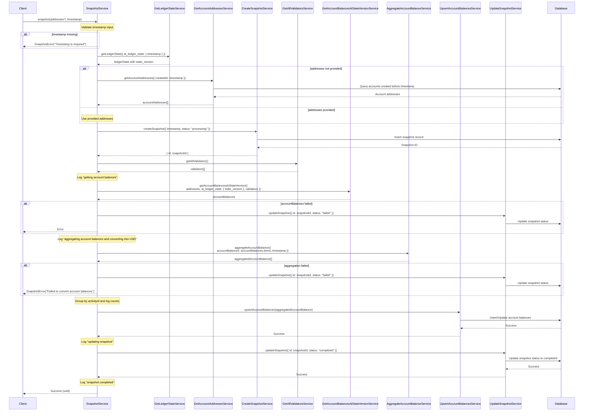

# Snapshot Service Flow

## Overview

The Snapshot Service is responsible for capturing point-in-time account balances and activity data for the Radix Incentives Campaign. This service processes blockchain data at specific timestamps to calculate user holdings, convert values to USD, and store the results for multiplier calculations and activity tracking.

## Sequence Diagram

## Process Flow

### 1. Input Validation
- Validates that a timestamp is provided
- Optionally accepts specific account addresses to process

### 2. Ledger State Resolution
- Retrieves the blockchain state at the specified timestamp
- Gets the corresponding state_version for balance queries

### 3. Account Address Resolution
- If addresses are provided, uses those specific accounts
- If not provided, fetches all accounts created before the timestamp

### 4. Snapshot Lifecycle Management
- Creates a snapshot record with "processing" status
- Tracks the snapshot process in the database
- Updates status to "failed" or "completed" based on results

### 5. Validator Data Collection
- Fetches all validator information needed for LSU balance calculations
- Required for converting liquid staking tokens to XRD equivalents

### 6. Balance Retrieval
- Gets account balances at the specific state version
- Processes various asset types (XRD, LSUs, LP tokens, etc.)
- Handles complex DeFi positions from multiple protocols

### 7. Balance Aggregation and USD Conversion
- Converts all balances to USD values
- Aggregates balances by activity type
- Groups data for efficient storage and processing

### 8. Data Persistence
- Upserts processed account balance data to the database
- Maintains historical balance records for multiplier calculations

### 9. Completion
- Updates snapshot status to "completed"
- Logs completion for monitoring and debugging

## Error Handling

The service implements comprehensive error handling:

- **Input Validation Errors**: Invalid timestamp or parameters
- **Blockchain Errors**: Gateway connectivity, state lookup failures
- **Processing Errors**: Balance calculation or aggregation failures
- **Database Errors**: Snapshot creation, update, or balance storage failures

Failed snapshots are marked with "failed" status and appropriate error logging.

## Key Dependencies

- **GetLedgerStateService**: Blockchain state lookup
- **GetAccountBalancesAtStateVersionService**: Core balance retrieval
- **AggregateAccountBalanceService**: USD conversion and aggregation
- **Database Services**: Snapshot and balance persistence
- **Validator Services**: Required for LSU calculations

## Usage in Incentives Campaign

This snapshot service is crucial for:
- **Multiplier Calculations**: Capturing XRD/LSU holdings for S-curve multipliers
- **Activity Tracking**: Recording baseline balances for activity detection
- **Historical Analysis**: Maintaining time-series data for campaign analytics
- **Week Completion**: Providing point-in-time data for weekly processing
