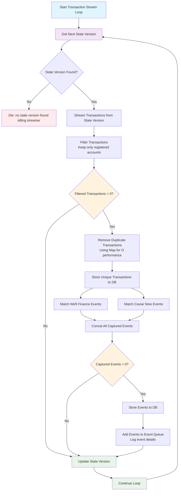

# Transaction Stream Loop Implementation

## Overview

The `transactionStreamLoop` function is the core blockchain monitoring component of the Radix Incentives Campaign Platform. It runs continuously to monitor the Radix ledger, filtering and processing transactions involving registered user accounts. The function captures relevant on-chain events from supported dApps and queues them for further processing into activity points.

## Function Signature

```typescript
transactionStreamLoop(): Effect<never, never, TransactionStreamLoopDependency>
```

### Dependencies

- `TransactionStreamService` - Service to stream transactions from Radix Gateway
- `StateVersionManagerService` - Service to manage blockchain state version tracking
- `FilterTransactionsService` - Service to filter transactions for registered accounts
- `AddEventsToDbService` - Service to store captured events to database
- `AddTransactionsToDbService` - Service to store transactions to database
- `AddToEventQueueService` - Service to add events to processing queue

### Event Matchers

- `weftFinanceEventMatcher` - Matches events from Weft Finance dApp
- `caviarnineEventMatcher` - Matches events from Caviar Nine dApp

## Flow Diagram



## Implementation Flow

1. **Infinite Loop Initialization**: Starts a continuous monitoring loop that runs indefinitely
2. **State Version Retrieval**: Gets the next state version to process from the blockchain
3. **Failure Handling**: Terminates the streamer if no state version is found (critical failure)
4. **Transaction Streaming**: Retrieves transactions from the Radix Gateway starting from the current state version
5. **Transaction Filtering**: Filters transactions to include only those involving registered user accounts
6. **Deduplication**: Removes duplicate transactions using a Map for O(n) performance optimization
7. **Transaction Persistence**: Stores unique transactions to the database for audit and reference
8. **Event Matching**: Processes transactions through multiple event matchers:
   - Weft Finance events (currently processed but not included in final array)
   - Caviar Nine events (included in processing pipeline)
9. **Event Storage**: Saves all captured events to the database
10. **Event Queuing**: Adds events to the processing queue with detailed logging
11. **State Version Update**: Updates the state version to mark progress and prevent reprocessing
12. **Loop Continuation**: Returns to step 2 to continue monitoring

## Key Features

### Continuous Monitoring
- Runs in an infinite loop to provide real-time blockchain monitoring
- Processes transactions as they occur on the Radix network
- Maintains state version tracking to ensure no transactions are missed

### Performance Optimizations
- **Deduplication**: Uses Map data structure for O(n) duplicate removal
- **Batch Processing**: Processes multiple transactions and events in batches
- **Filtered Processing**: Only processes transactions involving registered accounts

### Event Capture System
- **Modular Event Matchers**: Separate matchers for different dApps (Weft Finance, Caviar Nine)
- **Extensible Architecture**: Easy to add new event matchers for additional dApps
- **Comprehensive Logging**: Detailed logging of captured events for monitoring

### Error Handling
- **Critical Failure Protection**: Terminates if state version management fails
- **Graceful Empty Processing**: Handles cases with no transactions or events
- **State Consistency**: Ensures state version is always updated to maintain consistency

## Data Flow

### Transaction Processing Pipeline
```
State Version → Stream Transactions → Filter → Deduplicate → Store → Update State Version
```

### Event Processing Pipeline
```
Transactions → Event Matching → Event Storage → Event Queuing → Activity Processing
```

## Supported dApps

### Caviar Nine
- Events are captured and processed through the incentives pipeline
- Includes various DeFi activities like trading, liquidity provision, lending

### Weft Finance
- Events are captured but currently not included in the final processing array
- May be activated in future updates

## Performance Considerations

- **Memory Efficiency**: Uses Map for deduplication to minimize memory usage
- **Batch Operations**: Processes multiple transactions and events in single database operations
- **Filtered Processing**: Only processes relevant transactions to reduce computational overhead
- **State Management**: Efficient state version tracking to avoid reprocessing

## Monitoring & Observability

### Logging
- Transaction counts and processing status
- Event capture details including dApp, event type, transaction ID, and event index
- State version updates and progress tracking
- Error conditions and failure scenarios

### Metrics
- Number of transactions processed per cycle
- Number of events captured by dApp
- Processing time per cycle
- State version progression rate

## Integration Points

### Blockchain Integration
- **Radix Gateway**: Primary source for transaction streaming
- **State Version Management**: Tracks blockchain state to ensure complete coverage
- **Account Registration**: Only processes transactions for accounts registered in the incentives campaign

### Database Integration
- **Transaction Storage**: Stores all relevant transactions for audit and reference
- **Event Storage**: Persists captured events for processing into activity points
- **State Persistence**: Maintains state version tracking across restarts

### Queue Integration
- **Event Queue**: Feeds captured events to downstream processing systems
- **Activity Processing**: Events are processed into user activities and points

## Error Scenarios

### Critical Failures
- **No State Version**: Terminates the streamer if state version management fails
- **Database Connectivity**: May cause processing delays or failures

### Recoverable Conditions
- **Empty Transaction Batches**: Continues processing with state version update
- **No Events Captured**: Normal operation, continues to next cycle
- **Duplicate Transactions**: Handled through deduplication logic

## Usage Context

This function is typically:
- **Always Running**: Deployed as a long-running background service
- **Singleton Process**: Only one instance should run to avoid duplicate processing
- **Infrastructure Component**: Core part of the blockchain monitoring infrastructure
- **Event Source**: Primary source of on-chain activity data for the incentives system

## Security Considerations

- **Account Filtering**: Only processes transactions for registered accounts
- **State Consistency**: Prevents gaps or duplicate processing through state version management
- **Data Integrity**: Stores complete transaction data for audit and verification
- **Event Validation**: Events are validated through specific matchers before processing

## Scalability Considerations

- **Horizontal Scaling**: Currently designed as a singleton, but could be partitioned by account ranges
- **Throughput**: Optimized for high transaction volumes through batch processing
- **Storage Growth**: Transaction and event storage will grow continuously and may require archiving strategies
- **Processing Latency**: Near real-time processing with minimal delay between on-chain events and capture
