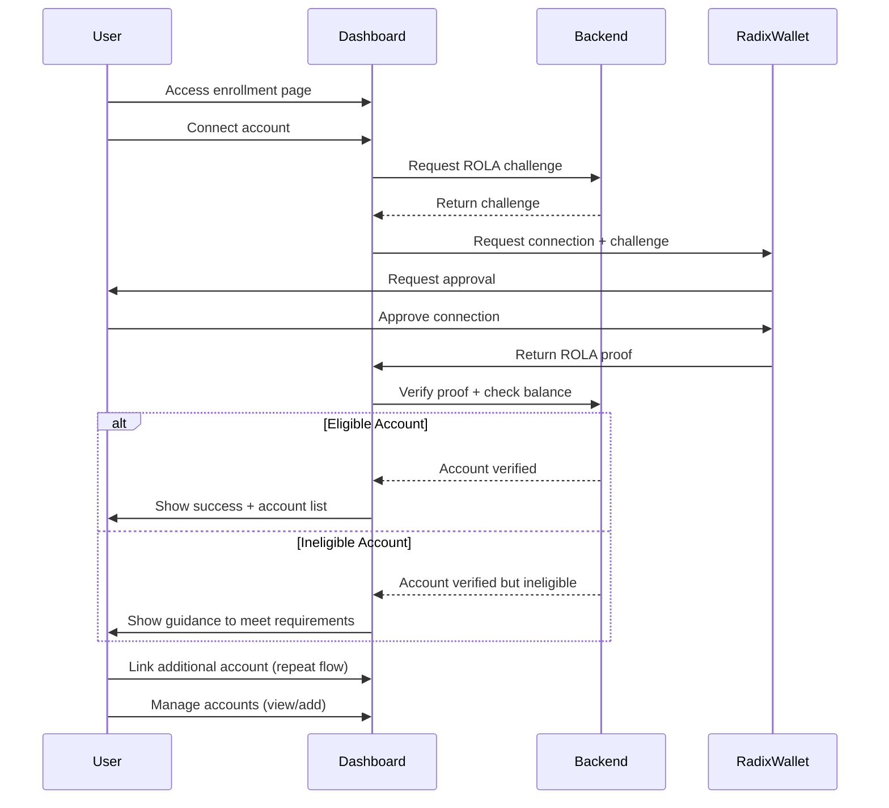

# 🔗 Connect & View Linked Accounts

## User Story

As a Radix user, I want to enroll in the incentives program and connect multiple accounts to earn points across all my wallets with a unified dashboard view.

## Acceptance Criteria

- Users can access enrollment page and connect one or many account(s) via Radix Connect with ROLA verification
- Users can link additional accounts
- Dashboard displays all linked accounts
- Verify that account has been created on-ledger (ie not a virtual account)

## Technical Considerations

- Radix-dApp-toolkit integration
- ROLA verification flow for each account
- Responsive design with proper error handling

## Flow Diagram

