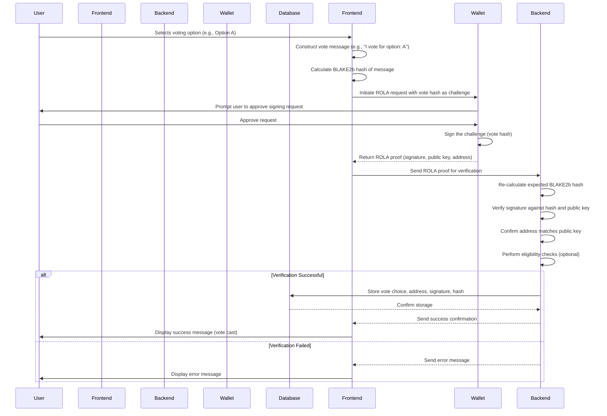

# User Voting Implementation Plan

## Overview

This plan details the steps required to implement the user voting mechanism for community consultations within the Radix Incentives Campaign Platform. The flow leverages Radix Off-Ledger Authentication (ROLA) via the Radix dApp Toolkit to securely capture and verify user votes without requiring on-chain transactions for the voting act itself. Voting power (based on token holdings) will be calculated separately during the tallying phase using snapshots.

## Voting Flow

1.  **User Interface Interaction:**

    - The user navigates to the active community consultation section within the dashboard.
    - The user reviews the consultation details (question, options, rules, deadlines).
    - The user selects their desired voting option (e.g., clicks a button for "Option A").

2.  **Message Hashing:**

    - Upon selection, the frontend constructs a standardized message string representing the user's choice (e.g., "I vote for option: A" or structured data like `{"consultationId": "xyz", "option": "A"}`).
    - The frontend calculates the BLAKE2b hash (32-byte digest) of this message string.

3.  **ROLA Challenge Request:**

    - The frontend initiates a ROLA request using the Radix dApp Toolkit.
    - The **challenge** payload for the ROLA request is set to the 32-byte BLAKE2b hash generated in the previous step.
    - The request specifies the origin and potentially the dApp definition address.

4.  **Wallet Interaction & Signing:**

    - The Radix Wallet receives the ROLA request.
    - The wallet prompts the user to approve the signing request, displaying the dApp origin and potentially information about the action (though the hash itself isn't directly human-readable).
    - Upon user approval, the wallet signs the provided challenge (the vote hash) using the private key(s) associated with the selected user account(s).
    - The wallet sends the signed challenge(s) (ROLA proof) back to the dApp frontend.

5.  **Backend Verification:**

    - The frontend sends the ROLA proof (signed challenge, public key, account address) to the backend API.
    - The backend verifies the signature(s):
      - It re-calculates the expected BLAKE2b hash from the originally selected option (which should also be sent to the backend or reconstructed consistently).
      - It uses the provided public key and signature to verify that the signature matches the calculated hash.
      - It confirms the account address corresponds to the public key used for signing.
      - It may perform additional checks (e.g., ensuring the account is eligible to vote).

6.  **Database Storage:**

    - If verification is successful, the backend stores the user's vote choice, the associated account address, the signature, and potentially the hash and timestamp in the database (e.g., a `UserVotes` table). This creates an auditable record of the authenticated vote.

7.  **User Feedback:**
    - The frontend receives confirmation from the backend.
    - The UI updates to show the user that their vote has been successfully cast and recorded.

## Sequence Diagram

## Subsequent Steps (Tallying - Separate Process)

- At the end of the voting period, a separate process will:
  - Fetch all verified votes for the consultation from the database.
  - Retrieve the relevant token holding snapshot data (XRD, LSUs, etc.) for the voting accounts.
  - Calculate the voting power for each account based on the snapshot(s) and configured rules.
  - Aggregate the voting power for each option.
  - Determine and display the final results.
