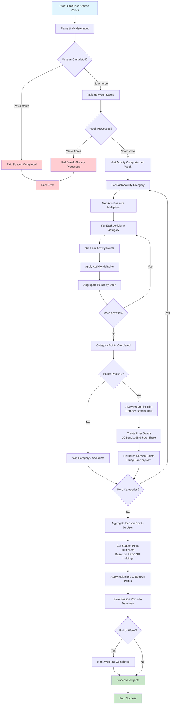

# Calculate Season Points Flow

## Overview

The `calculateSeasonPoints` service is responsible for converting weekly user activity points into season points at the end of each week. This process involves complex calculations including percentile-based distribution, multiplier applications, and band-based point allocation to ensure fair distribution across users.

## Purpose

- Convert weekly activity points into season points that contribute to overall rankings
- Apply activity-specific multipliers to user points before distribution
- Use percentile-based trimming to remove low-activity users
- Distribute points using a banded system that rewards top performers while ensuring broader participation
- Apply season point multipliers based on user holdings (XRD, LSU, etc.)
- Mark weeks as completed after successful processing

## Input Parameters

- `seasonId`: The season to calculate points for
- `weekId`: The specific week to process
- `force`: Optional flag to override validation checks (allows reprocessing completed seasons/weeks)
- `endOfWeek`: Boolean flag indicating if this is the final processing (marks week as completed)

## Key Constants and Thresholds

- **Minimum XRD Balance**: Required threshold for users to be eligible for season points
- **Lower Bounds Percentage**: 10% - removes bottom 10% of users from distribution
- **Number of Bands**: 20 bands for distributing season points
- **Pool Share Start**: 98% of points allocated through banded distribution
- **Pool Share Step**: 1.15x multiplier between bands
- **Minimum Activity Points**: Category-specific thresholds:
  - Most categories (common, tradingVolume, componentCalls, transactionFees): 1 point
  - Other categories: 10,000 points (default threshold)

## Process Flow

### 1. Input Validation & State Checks
- Parse and validate input parameters
- Verify season is not completed (unless force flag is set)
- Verify week is not already processed (unless force flag is set)
- Log processing details for audit trail

### 2. Activity Category Processing
- Retrieve all activity categories configured for the week
- For each category, get associated activities with their multipliers
- Calculate total user activity points per category after applying activity multipliers

### 3. User Activity Points Aggregation
- For each activity within a category:
  - Get user activity points meeting minimum thresholds
  - Apply activity-specific multipliers
  - Aggregate points by user across all activities in the category

### 4. Season Points Distribution per Category
- Apply percentile trimming (remove bottom 10% of users)
- Create user bands based on activity point distribution
- Distribute category's point pool across bands using configured ratios
- Generate season points for each qualifying user

### 5. Final Season Points Calculation
- Aggregate season points across all categories for each user
- Retrieve and apply season point multipliers (based on XRD/LSU holdings)
- Generate final season points for each user

### 6. Persistence & Completion
- Save calculated season points to database
- Mark week as completed if `endOfWeek` flag is set
- Log successful completion

## Flow Diagram

## Key Algorithms

### Band Creation Algorithm
- Users are sorted by activity points in **ascending order** (lowest points first)
- 20 bands are created with exponentially decreasing sizes
- Each band receives a share of the points pool based on a 1.15x step multiplier
- **Later bands** (containing higher-point users) receive significantly more points than earlier bands

### Percentile Trimming
- Bottom 10% of users (by activity points) are excluded from season point distribution
- Ensures only users with meaningful activity receive rewards
- Prevents spam/low-value activities from diluting rewards

### Multiplier Application
- Activity multipliers are applied before band calculation
- Season point multipliers (XRD/LSU holdings) are applied after band calculation
- This ensures holding multipliers affect final rewards but don't distort activity-based rankings

## Error Handling

- **InputValidationError**: Invalid input parameters
- **InvalidStateError**: Season already completed or week already processed
- All errors include descriptive messages for debugging
- Force flag allows overriding state validation for reprocessing

## Dependencies

- **UserActivityPointsService**: Retrieves user activity points for the week
- **ActivityCategoryWeekService**: Gets activity categories configured for the week
- **GetSeasonPointMultiplierService**: Retrieves holding-based multipliers
- **AddSeasonPointsToUserService**: Persists calculated season points
- **UpdateWeekStatusService**: Marks week as completed
- **SeasonService** & **WeekService**: Entity validation and retrieval

## Performance Considerations

- Processes users in batches by activity category
- Uses BigNumber for precise decimal calculations
- Efficient grouping and aggregation algorithms
- Minimal database queries through service layer abstraction
