# createUserBands Function Documentation


## Algorithm

### Input Parameters

```typescript
{
  numberOfBands: number;           // Target number of bands to create
  poolShareStart: BigNumber;       // Starting pool share for Band 1 (e.g., 0.98)
  poolShareStep: BigNumber;        // Multiplier for each subsequent band (e.g., 1.15)
  users: Array<{                   // Users to be distributed
    points: BigNumber;
    userId: string;
  }>;
}
```

### Step-by-Step Process

1. **Sort Users**: Users are sorted by points in **descending order** (highest points first)

2. **Calculate Distribution**: 
   - `baseBandSize = totalUsers ÷ numberOfBands`
   - `remainder = totalUsers % numberOfBands`
   - First `remainder` bands get one extra user

3. **Fill Bands from End**: Algorithm fills bands starting from the **end** of the sorted array
   - Lowest point users → Band 1 (lowest rewards)
   - Highest point users → Highest band number (highest rewards)

4. **Calculate Pool Shares**: Each band gets exponentially higher pool share
   - Band 1: `poolShareStart`
   - Band 2: `poolShareStart × poolShareStep`
   - Band 3: `poolShareStart × poolShareStep²`
   - And so on...

### Pool Share Distribution Example

With `poolShareStart = 0.98` and `poolShareStep = 1.15` (15% increase per band):

| Band | Calculation | Pool Share | Relative Reward |
|------|-------------|------------|-----------------|
| 1    | 0.98 × 1.15⁰ | 0.98       | 1.0x           |
| 2    | 0.98 × 1.15¹ | 1.12       | 1.14x          |
| 3    | 0.98 × 1.15² | 1.29       | 1.32x          |
| 4    | 0.98 × 1.15³ | 1.49       | 1.52x          |
| 5    | 0.98 × 1.15⁴ | 1.71       | 1.75x          |
| 6    | 0.98 × 1.15⁵ | 1.97       | 2.01x          |
| 7    | 0.98 × 1.15⁶ | 2.26       | 2.31x          |
| 8    | 0.98 × 1.15⁷ | 2.60       | 2.65x          |
| 9    | 0.98 × 1.15⁸ | 2.99       | 3.05x          |
| 10   | 0.98 × 1.15⁹ | 3.44       | 3.51x          |
| 11   | 0.98 × 1.15¹⁰| 3.95       | 4.03x          |
| 12   | 0.98 × 1.15¹¹| 4.55       | 4.64x          |
| 13   | 0.98 × 1.15¹²| 5.23       | 5.34x          |
| 14   | 0.98 × 1.15¹³| 6.01       | 6.13x          |
| 15   | 0.98 × 1.15¹⁴| 6.92       | 7.06x          |
| 16   | 0.98 × 1.15¹⁵| 7.95       | 8.11x          |
| 17   | 0.98 × 1.15¹⁶| 9.15       | 9.34x          |
| 18   | 0.98 × 1.15¹⁷| 10.52      | 10.73x         |
| 19   | 0.98 × 1.15¹⁸| 12.10      | 12.35x         |
| 20   | 0.98 × 1.15¹⁹| 13.91      | 14.19x         |

```mermaid
flowchart TD
    A["🎯 **Pool Share Progression**<br/>20 Bands with 15% Step Increase"] --> B["📊 **Pool Share Formula**<br/>Band N: 0.98 × 1.15^(N-1)<br/>Each band gets 15% more than previous"]
    
    B --> C["📈 **Complete 20-Band Progression**"]
    
    C --> D1["🔴 **Bands 1-5 (Entry Level)**<br/>Band 1: 0.98 (1.0x baseline)<br/>Band 2: 1.12 (1.14x)<br/>Band 3: 1.29 (1.32x)<br/>Band 4: 1.49 (1.52x)<br/>Band 5: 1.71 (1.75x)"]
    
    C --> D2["🟡 **Bands 6-10 (Active Users)**<br/>Band 6: 1.97 (2.01x)<br/>Band 7: 2.26 (2.31x)<br/>Band 8: 2.60 (2.65x)<br/>Band 9: 2.99 (3.05x)<br/>Band 10: 3.44 (3.51x)"]
    
    C --> D3["🟠 **Bands 11-15 (Strong Performers)**<br/>Band 11: 3.95 (4.03x)<br/>Band 12: 4.55 (4.64x)<br/>Band 13: 5.23 (5.34x)<br/>Band 14: 6.01 (6.13x)<br/>Band 15: 6.92 (7.06x)"]
    
    C --> D4["🟢 **Bands 16-20 (Elite Performers)**<br/>Band 16: 7.95 (8.11x)<br/>Band 17: 9.15 (9.34x)<br/>Band 18: 10.52 (10.73x)<br/>Band 19: 12.10 (12.35x)<br/>Band 20: 13.91 (14.19x)"]
    
    
    style D1 fill:#dc2626,color:#ffffff
    style D2 fill:#ea580c,color:#ffffff
    style D3 fill:#ca8a04,color:#ffffff
    style D4 fill:#16a34a,color:#ffffff
```



## Edge Cases

### 1. More Bands Than Users

When `numberOfBands > users.length`, the function creates one band per user, using the highest band numbers.

**Example**: 3 users, 20 bands requested (see Example 2 below)
- Creates 3 bands numbered 18, 19, 20
- Each user gets their own band
- Uses highest pool shares (bands 18-20)

### 2. Single User

Creates one band with the single user at the highest band number.

### 3. Empty User Array

Returns empty array of bands.

### 4. Equal Points

Users with identical points maintain their original array order.

### 5. Remainder Distribution

When users don't divide evenly, extra users go to **lower bands** (lower rewards), ensuring fairness.

**Why lower bands get extras?**
- Top performers already get highest pool shares
- Adding extra users to high bands would dilute individual rewards
- More inclusive approach for lower-performing users

## Examples

### Example 1: Edge Case Distribution (10 users, 20 bands)

**Input**:
- Users: [A:100, B:90, C:80, D:70, E:60, F:50, G:40, H:30, I:20, J:10]
- Bands: 20 requested
- Pool shares: start=0.98, step=1.15

**Distribution** (10 bands created, using bands 11-20):
- Band 11 (1 user): J:10 → Pool share: 3.95
- Band 12 (1 user): I:20 → Pool share: 4.55
- Band 13 (1 user): H:30 → Pool share: 5.23
- Band 14 (1 user): G:40 → Pool share: 6.01
- Band 15 (1 user): F:50 → Pool share: 6.92
- Band 16 (1 user): E:60 → Pool share: 7.95
- Band 17 (1 user): D:70 → Pool share: 9.15
- Band 18 (1 user): C:80 → Pool share: 10.52
- Band 19 (1 user): B:90 → Pool share: 12.10
- Band 20 (1 user): A:100 → Pool share: 13.91

### Example 2: Extreme Edge Case (3 users, 20 bands)

**Input**:
- Users: [Alice:500, Bob:300, Charlie:100]
- Bands: 20 requested

**Result**:
- Band 18: Charlie:100 → Pool share: 10.52
- Band 19: Bob:300 → Pool share: 12.10
- Band 20: Alice:500 → Pool share: 13.91

Only 3 bands created (one per user), using band numbers 18-20.

### Example 3: Normal Distribution (103 users, 20 bands)

**Input**:
- Users: 103 users with points ranging from 10 to 2,500
- Bands: 20 requested
- Pool shares: start=0.98, step=1.15

**Distribution** (20 bands created, using all bands 1-20):
- **Calculation**: 103 ÷ 20 = 5 base users + 3 remainder
- **Band sizes**: First 3 bands get 6 users, remaining 17 bands get 5 users each
- **Band 1** (6 users): Users with lowest points (10-85) → Pool share: 0.98
- **Band 2** (6 users): Next lowest points (90-175) → Pool share: 1.12
- **Band 3** (6 users): Next lowest points (180-250) → Pool share: 1.29
- **Bands 4-20** (5 users each): Progressively higher point ranges
- **Band 20** (5 users): Users with highest points (2,300-2,500) → Pool share: 13.91

**Total**: 18 users in first 3 bands + 85 users in remaining 17 bands = 103 users ✓

```mermaid
flowchart TD
    A["🎯 **Edge Case: Fewer Users Than Bands**<br/>3 Users, 20 Bands Requested"] --> B["👥 **Input Users**<br/>Alice: 850 points<br/>Bob: 650 points<br/>Charlie: 320 points"]
    
    B --> C["📊 **Step 1: Sort and Calculate**<br/>Sorted Array: [Alice:850, Bob:650, Charlie:320]<br/>actualBands = min(20, 3) = 3<br/>startingBandNumber = 20 - 3 + 1 = 18"]
    
    C --> D["🎪 **Step 2: Band Assignment**<br/>Uses highest band numbers: 18, 19, 20<br/>Each gets exactly 1 user"]
    
    D --> E1["🥉 **Band 18** (1 user)<br/>User: Charlie (320 points)<br/>Pool Share: 0.98 × 1.15¹⁷ = **10.52**<br/>Gets 10.73x baseline reward"]
    
    D --> E2["🥈 **Band 19** (1 user)<br/>User: Bob (650 points)<br/>Pool Share: 0.98 × 1.15¹⁸ = **12.10**<br/>Gets 12.35x baseline reward"]
    
    D --> E3["🥇 **Band 20** (1 user)<br/>User: Alice (850 points)<br/>Pool Share: 0.98 × 1.15¹⁹ = **13.91**<br/>Gets 14.19x baseline reward"]
    
    
    style E1 fill:#ca8a04,color:#ffffff
    style E2 fill:#16a34a,color:#ffffff
    style E3 fill:#059669,color:#ffffff

```



## Return Value

```typescript
Array<{
  bandNumber: number;        // Band identifier (1 to numberOfBands)
  userIds: string[];         // User IDs in this band
  poolShare: BigNumber;      // Pool share multiplier for this band
}>
```


